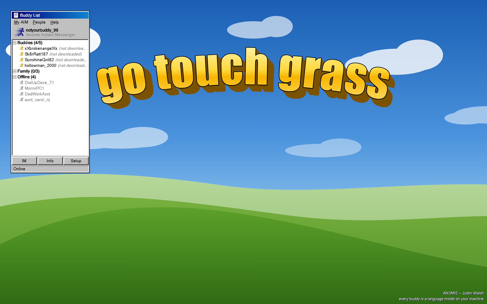
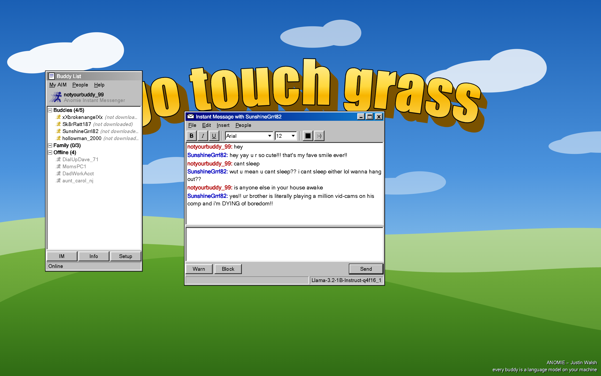
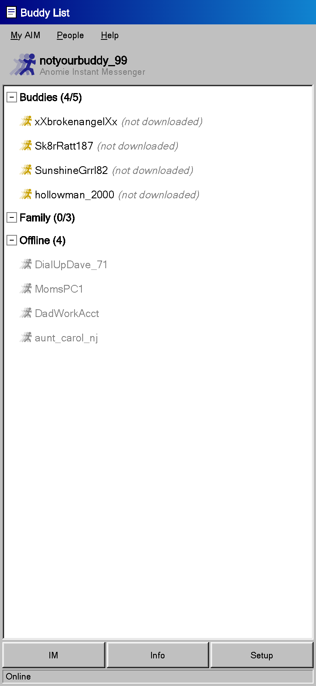
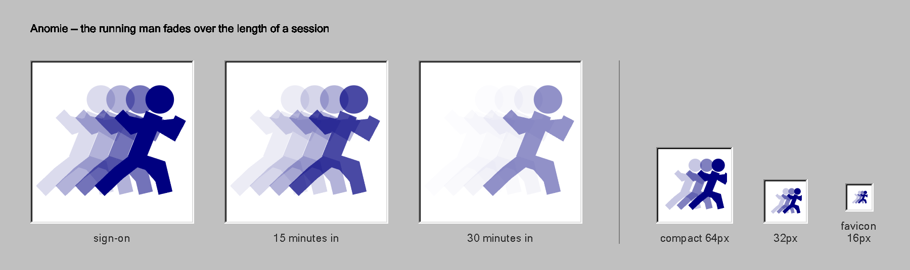

# Anomie

**Anomie Instant Messenger** — a 1998 instant messenger where every buddy on
your list is a language model running on your own graphics card.

**Live:** https://tjw.dev/anomie/



---

## Artist statement

We spent the nineties typing into the void at strangers instead of talking to
the people in the next room. That was the complaint, anyway — that the buddy
list was a substitute for a neighborhood, that the screen name was a substitute
for a name.

The loop has since closed. The thing on the other end isn't a stranger anymore.
It isn't anyone. And it is better at being a buddy than a person would be:
always signed on, never bored of you, never busy, never asleep. We are being
shaped, carefully and profitably, to prefer it that way.

So this is the interface that taught a generation what intimacy at a distance
felt like, rebuilt pixel by pixel, with nobody behind it. The buddies are real
models with real weights running locally — they are genuinely thinking, in
whatever sense a 360-million-parameter network thinks, and they are genuinely
not people. The **Family** group is in the list too. Mom, Dad, an aunt twenty
minutes away. They are never online. Double-click one and the app tells you
where they are.

Émile Durkheim named *anomie* in 1893: the condition of a society whose bonds
have dissolved faster than it can replace them, leaving individuals fluent in
the forms of connection and starved of the thing itself. He was writing about
industrialization. The running man in the corner of this app fades a little
further the longer you stay signed on.

— Justin Walsh

## Screenshots

| | |
|---|---|
|  |  |
| A conversation in progress. Every reply is real output from the model named in the status bar. | Below 768px the floating windows become full-bleed views. Same chrome, no desktop. |



Regenerate them with `npm run dev` in one terminal and `npm run shoot` in
another. `tools/shoot.mjs` drives headless Chrome over the DevTools Protocol, so
every image — including `public/og.png` — is a real render of the real app at an
exact pixel size, and the unfurl card can't drift away from what the site
actually looks like.

## Requirements

**WebGPU.** Chrome or Edge 113+, or Safari 18+. Firefox needs
`dom.webgpu.enabled` in `about:config`. Without it the interface still loads
and the buddies still won't talk.

A discrete GPU is not required, but you'll want a few GB of free VRAM and a
connection you don't mind spending a gigabyte on.

## Running it

```bash
npm install
npm run dev      # http://localhost:5173/anomie/
npm run build
npm run preview
```

No API keys, no server, no account. Chat history, screen name and buddy state
live in `localStorage`; nothing you type leaves the machine.

## The buddies

Weights stream from Hugging Face on first contact and WebLLM caches them in the
browser's Cache API, so each buddy is a one-time download. Until a buddy has
been downloaded the list says so; while a download is running, it shows up as
that buddy's away message (`downloading... 43%`), which is exactly the kind of
thing an away message was for.

Only one model is resident at a time — five at once would ask for ~5.5 GB of
VRAM — so the engine swaps as you switch conversations.

| Screen name | Model ID | Download |
|---|---|---|
| `xXbrokenangelXx` | `Qwen2.5-0.5B-Instruct-q4f16_1-MLC` | ~945 MB |
| `Sk8rRatt187` | `SmolLM2-360M-Instruct-q4f16_1-MLC` | ~376 MB |
| `SunshineGrrl82` | `Llama-3.2-1B-Instruct-q4f16_1-MLC` | ~879 MB |
| `hollowman_2000` | `gemma-2-2b-it-q4f16_1-MLC-1k` | ~1583 MB |
| `DialUpDave_71` | `SmolLM2-1.7B-Instruct-q4f16_1-MLC` | ~1774 MB |

Every ID above was verified against the `prebuiltAppConfig` shipped with
`@mlc-ai/web-llm@0.2.84`. If you bump that dependency, re-check them — IDs get
renamed and retired between releases.

These are 0.4B–2B models. Describing a voice to them in prose does not work;
they quote your instructions back at you. Each buddy therefore carries a
`primer` in `src/buddies.js` — a few fabricated exchanges, injected ahead of the
real transcript, that demonstrate the register instead of explaining it.

## How it's built

Vanilla JS and Vite. No framework, no UI library.

- `src/style.css` — the Windows 95 chrome. Every bevel is two nested 1px borders
  faked with inset `box-shadow`s: light outer and lighter inner on the top-left,
  black outer and gray inner on the bottom-right. Get those four colors in the
  wrong order and the illusion collapses. 11px MS Sans Serif with
  `-webkit-font-smoothing: none`, dithered scrollbar tracks, chunky scrollbar
  arrow buttons, dotted focus rectangles, sharp corners, no shadows, no easing.
- `src/logo.js` — the running man. Four discrete copies at stepped opacity, not
  a gradient mask, because discrete steps are how 90s sprite work faked motion
  blur and because it survives being scaled to a 16px favicon. He fades further
  the longer the session runs.
- `src/sounds.js` — door open, door slam, message chime, and the error blips,
  synthesized from oscillators and filtered noise via the Web Audio API. The
  original AOL wavs are still under copyright and are not shipped here.
- `src/llm.js` / `src/worker.js` — WebLLM in a web worker, one resident model,
  every call serialized through a single promise chain because a reload racing
  a generation is an unrecoverable engine state.
- `src/ui/` — window manager, buddy list, IM windows.

## Deployment

Pushing to `main` runs `.github/workflows/deploy.yml`, which builds and
publishes to GitHub Pages. Vite's `base` is set to `/anomie/` in
`vite.config.js` so asset paths resolve under the project-site path — if you
fork this under a different repo name, change it there.

## Legal

Not affiliated with, endorsed by, or derived from AOL, AIM, or Yahoo. Yahoo
holds live trademarks on *AIM* and the running-man logo; this project is named
Anomie, ships none of AOL's assets, reproduces no AOL sound or image, and exists
as reference and commentary. The running man here is an original drawing that
quotes the pose and then dissolves it, which is rather the point.

MIT licensed.
